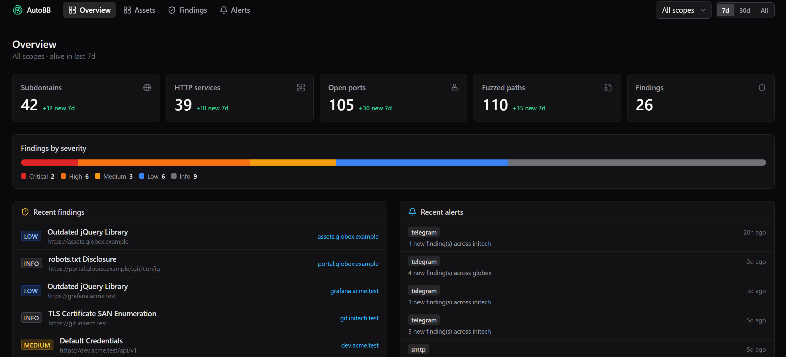

# AutoBB Web UI

A **read-only** web dashboard over the recon data that
[`rivalsec/autobb`](https://github.com/rivalsec/autobb) writes to MongoDB.

AutoBB is a CLI/Docker recon pipeline (subfinder → dnsx → httpx → naabu → nuclei)
with no UI. This project visualises its asset inventory and findings. It **does
not** trigger scans or edit configuration — the pipeline remains the sole writer;
the UI only reads.



## Try the demo (one line)

No clone, no build — pulls a pre-seeded MongoDB and the UI, both as published
images, and serves them on loopback:

```bash
curl -fsSL https://raw.githubusercontent.com/rivalsec/autobb-webui/main/demo/docker-compose.yml \
  | docker compose -f - -p autobb-demo up
```

Then open <http://127.0.0.1:8000>. `Ctrl-C` stops it; nothing persists (no
volume), so each run reseeds with fresh data.

The dataset is **synthetic** — fictional companies on the reserved
`.test`/`.example` TLDs, no real recon. To try it from a checkout instead (and
build the images locally):

```bash
docker compose -f demo/docker-compose.build.yml -p autobb-demo up --build
```

See [`demo/`](demo/) for the seed generator and image definitions. The
published images are built by the [`Publish demo images`](.github/workflows/docker-publish.yml)
workflow; make both GHCR packages **public** so the one-liner can pull them
without auth.

---

## Layout

```
backend/    FastAPI + Motor read-only API
  app/
    main.py            app wiring, CORS, auth gate, SPA serving
    config.py          settings (MONGO_URI, AUTH_TOKEN, …)
    db.py              Motor client + collection names
    auth.py            shared token gate
    query.py           base_filter (mirrors export.py) + pagination/sort
    scopes.py          scope-name resolution (DB distinct or config YAML)
    serializers.py     BSON → JSON (ObjectId/datetime, hyphenated nuclei keys)
    routers/           scopes, stats, assets, findings, host, alerts, meta
frontend/   Vite + React + TS + Tailwind + TanStack Query/Table
  src/
    state/AppContext   global scope + alive-window + auth
    components/         DataTable, ScopeSelect, AliveWindowToggle, SeverityBadge, …
    pages/             Overview, Assets, Findings, HostDetail, Alerts
```

---

## Quick start (development)

Two terminals. The backend talks to your existing autobb MongoDB; the Vite dev
server proxies `/api` to it.

### 1. Backend

```bash
cd backend
python3 -m venv venv            # Python 3.11–3.13 recommended
./venv/bin/pip install -r requirements.txt
cp .env.example .env            # edit MONGO_URI / MONGO_DB / AUTH_TOKEN
./venv/bin/uvicorn app.main:app --reload --host 127.0.0.1 --port 8000
```

Check it: `curl http://127.0.0.1:8000/api/health` → `{"status":"ok","mongo":true,...}`

### 2. Frontend

```bash
cd frontend
npm install
npm run dev                     # http://localhost:5173 (proxies /api → :8000)
```

Open <http://localhost:5173>.

---

## Production (single origin)

Build the SPA; the API serves it from `/` automatically when `frontend/dist`
exists (controlled by `FRONTEND_DIST`).

```bash
cd frontend && npm run build         # → frontend/dist
cd ../backend && ./venv/bin/uvicorn app.main:app --host 127.0.0.1 --port 8000
```

Now the dashboard **and** the API are on `http://127.0.0.1:8000`.

### Docker

A multi-stage image builds the SPA and serves everything from FastAPI:

```bash
docker compose up --build        # serves on 127.0.0.1:8000 by default
```

Point `MONGO_URI` at your MongoDB (see `docker-compose.yml`). The compose file
binds the published port to `127.0.0.1` only.

---

## Configuration (`backend/.env`)

| Var | Default | Notes |
|---|---|---|
| `MONGO_URI` | `mongodb://127.0.0.1:27017` | Use **read-only** Mongo credentials in prod. |
| `MONGO_DB` | `autobbdb` | autobb database name. |
| `DEFAULT_ALIVE_DAYS` | `30` | Default "alive" window (mirrors `export.py`). |
| `AUTH_TOKEN` | *(empty)* | When set, every `/api` call needs it. Empty ⇒ auth **disabled** (dev only). |
| `CORS_ORIGINS` | `http://localhost:5173,…` | Allowed SPA origins. |
| `HOST` / `PORT` | `127.0.0.1` / `8000` | **Do not** bind to a public interface. |
| `FRONTEND_DIST` | `../frontend/dist` | SPA build dir to serve, if present. |
| `SCOPES_CONFIG` | *(empty)* | Optional autobb-style YAML for the scope list; else derived from distinct `scope` values. |

---

## API

All list endpoints are paginated (`page`, `page_size` ≤ 200), sortable
(`sort`, `order`), and return `{ items, total, page, page_size }`. The shared
temporal filter mirrors `export.py`: `last_alive ≥ now − alive_days`
(`alive_days=0` or `all=true` disables it), optional `add_date ≥ now − added_days`,
and scope restriction.

| Method | Path | Purpose |
|---|---|---|
| GET | `/api/health` | Liveness + Mongo ping *(public)* |
| GET | `/api/auth/config` | Whether a token is required *(public)* |
| GET | `/api/auth/check` | Validate a token |
| GET | `/api/scopes` | Scope names + per-collection counts |
| GET | `/api/stats/overview` | Totals, new-7d, severity breakdown, recent findings/alerts |
| GET | `/api/domains` | Subdomains |
| GET | `/api/http_probes` | HTTP services (status_code, tech, tls, q filters) |
| GET | `/api/ports` | Open ports |
| GET | `/api/http_paths` | Fuzzed paths |
| GET | `/api/findings` | nuclei hits (active + passive merged) |
| GET | `/api/host/{host}` | Drilldown across all collections for one host |
| GET | `/api/alerts` | Notification history |

Interactive docs: `http://127.0.0.1:8000/docs`.

Auth (when `AUTH_TOKEN` is set) accepts either header:

```
Authorization: Bearer <token>
X-Auth-Token: <token>
```

The SPA prompts for the token and stores it in `localStorage`.

---

## Security

This dashboard exposes target reconnaissance data. Even read-only:

- **Set `AUTH_TOKEN`** and serve over a trusted boundary.
- **Never bind to a public interface** — keep `127.0.0.1` or run behind a reverse
  proxy / VPN. The compose file binds to loopback by default.
- Use a **read-only Mongo user** for `MONGO_URI`.
- No secrets from autobb's `config.yaml` (alert tokens, SMTP creds) are ever
  served to the client; the UI never reads them.

---

## Not in v1 (deferred to v2)

Triggering/scheduling scans, editing config/scopes/templates, multi-user RBAC,
triage workflow (writing finding status)...
